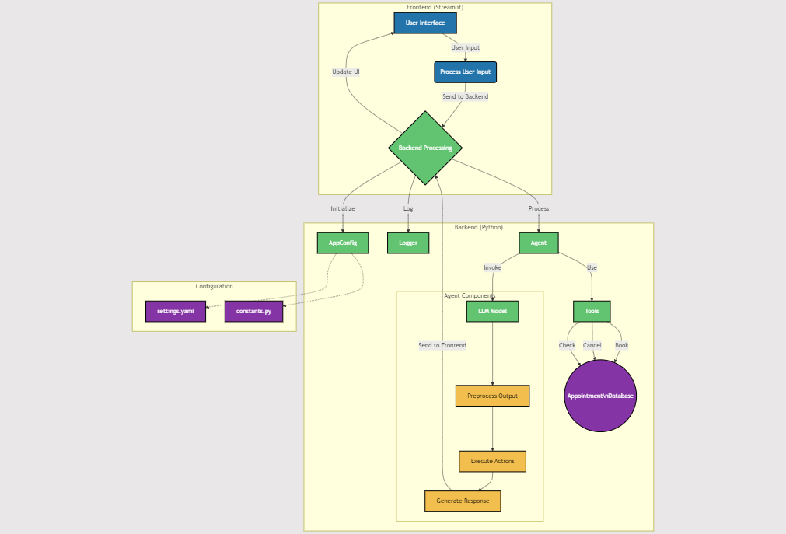

# Lets Build Online Booking System Using AI Agents

A Hands-On Guide to Creating a Local, Open-Source AI Agent Powered Booking Management System, Every Detail Spelled Out

TL;DR
This guide shows you how to build an AI Agent powered Booking System. You’ll learn to create a web app that uses artificial intelligence to understand and manage scheduling requests. It’s a practical example of how businesses can use AI to automate tasks and improve customer service. Whether you’re a coder or a business owner, you’ll see how AI can make scheduling easier and more efficient.

## Introduction

Ever wished you had a super-smart assistant to handle all your scheduling headaches? Well, you’re in luck! In this article, I’m going to show you how to build your very own AI-powered booking manager. It’s like having a tireless, always-on scheduling whiz at your fingertips. Let’s dive in and see how we can make appointment booking a breeze with a dash of artificial intelligence.

Full Article : [https://medium.com/@learn-simplified/lets-build-online-booking-system-using-ai-agents-1897189f1aa3


## What's This Project About

This article is your step-by-step guide to creating an intelligent appointment management system. We’re going to use some cool tools like Streamlit for building a sleek web interface, and LangChain for powering our AI brain.

I’ll walk you through setting up the basic structure, creating an AI agent that can understand and respond to scheduling requests, and building tools to actually book, check, and cancel appointments.

You’ll see how we can make our AI assistant conversational and user-friendly, while also keeping things organized behind the scenes. It’s like we’re building a digital receptionist that never sleeps!

## Why Work on It?

In today’s fast-paced business world, AI isn’t just a buzzword — it’s becoming a necessity. This article shows you how even a fictional company can implement AI to streamline one of the most time-consuming tasks: scheduling. By following along, you’ll get hands-on experience in integrating AI into a practical business application.

You’ll learn how to create a system that can understand natural language requests, manage a calendar, and interact with users in a human-like way. This isn’t just about building a cool project; it’s about seeing firsthand how AI can transform day-to-day operations, freeing up human resources for more complex tasks and providing 24/7 availability to clients.

Whether you’re a small business owner looking to modernize your operations or a developer curious about practical AI applications, this article has something valuable for you.

## Architecture



# Tutorial: Lets Build Online Booking System Using AI Agents

## Prerequisites
- Python installed on your system.
- A basic understanding of virtual environments and command-line tools.

## Steps

1. **Virtual Environment Setup:**
   - Create a dedicated virtual environment for our project:
   
     ```bash
     python -m venv Lets-Build-Online-Booking-System-Using-AI-Agents
     ```
   - Activate the environment:
   
     - Windows:
       ```bash
       Lets-Build-Online-Booking-System-Using-AI-Agents\Scripts\activate
       ```
     - Unix/macOS:
       ```bash
       source Lets-Build-Online-Booking-System-Using-AI-Agents/bin/activate
       ```
   
# Installation and Setup Guide

**Install Project Dependencies:**

Follow these steps to set up and run the Online Booking System Using AI Agents

1. Navigate to your project directory:
   ```
   cd path/to/your/project
   ```
   This ensures you're in the correct location for the subsequent steps.

2. Install the required dependencies:
   ```
   pip install -r requirements.txt
   ```
   This command installs all the necessary Python packages listed in the requirements.txt file.


## Run - Hands-On Guide: Lets Build Online Booking System Using AI Agents

   ```bash 
     
      # Run 
      streamlit run app.py
      
   ```

## Conclusion and Next Steps

Congratulations! You've just built Let's Build Online Booking System Using AI Agents